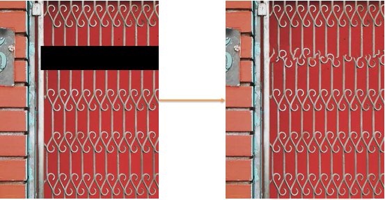

# image-completion
a C++ implementation of image completion with Criminisi algorithm

dependency: **OpenCV**

algorithm: **Criminisi algorithm**

## Result
in bin file directory, run `demo.exe`. Input the `golf.png` and enter you will see 

use the mouse to smear the woman, it looks like

press space (must on the image window not the cmd window), the program will fix it and display. The woman disappeared. The program used the surrounding infomation to complete the blank.

## Other Pictures

The program doesn't work well for below pictures. The first has plenty of blank, the second has the repeat unit which cannot be handled well because every part looks too similar.

There are many pictures that this program cannot fix well. (Literally, it means **most** pictures in **most** cases.)
