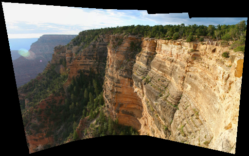
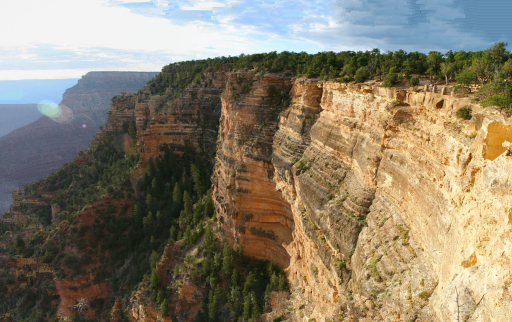

# image-completion
a C++ implementation of image completion with Criminisi algorithm

dependency: OpenCV

algorithm: Criminisi algorithm

## Result
in bin file directory, run demo.exe. Input the `golf.png` and enter you will see 

use the mouse to smear the woman, it looks like

press space (must on the image window not the cmd window), the program will fix it and display. The woman disappeared. The program used the surrounding infomation to complete the blank.

## Other Pictures

There are many pictures that this program cannot fix well. (Literally, it means most pictures.)
